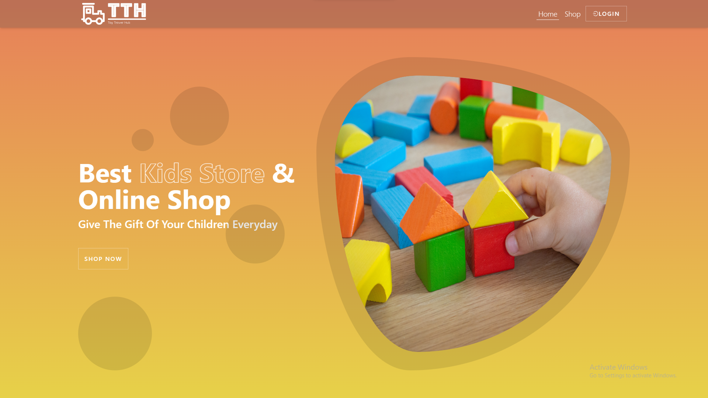

  Toy Trover Hub |
  We Brings Joy to your child

---

## About

Toy Trover Hub is a toy-selling website built with the MERN Stack (MongoDB, Express.js, ReactJS, Node.js). Explore a variety of toys with your child, purchase toys for them, and bring joy to their life

### Tech Stack

- **Frontend (UI) Development:**
  - ReactJS with JavaScript and JSX syntax.
  - Tailwind CSS and SASS for design.

- **Backend Development:**
  - Node.js as a runtime environment.
  - Express.js as a web application framework.

- **Database:**
  - MongoDB, a NoSQL database for efficient data storage.

- **Payment Processing:**
  - Stripe for secure and seamless payment transactions.

---

## Features

- **User Authentication:**
  - User registration and login system.

- **Admin Dashboard:**
  - Admin can efficiently manage website data.

- **Toys Listings:**
  - View all available toys with detailed information.

- **Single toys Page:**
  - Explore in-depth details about each toys.

- **Payment Gateway:**
  - Seamless integration of Stripe for secure payment processing.

- **Search Functionality:**
  - Users can find specific courses by name or category.

- **Shopping Cart:**
  - "Select Course" button to add products to the shopping cart.
  - "View Cart" feature displays all items in the cart.

---

## Project Demo

Click [here](https://toy-trover-hub.netlify.app/) to view the Skills Voyage project.

For Backend repository, click [here](https://github.com/the-pujon/toy-trover-hub-backend1).

---

## Credentials

### Admin Login:

- **Email:** pujondasauvi@gmail.com
- **Password:** password123456789

---

  <a href="https://toy-trover-hub.netlify.app/">Explore the <b>Toy Trover Hub</b> Platform</a>

